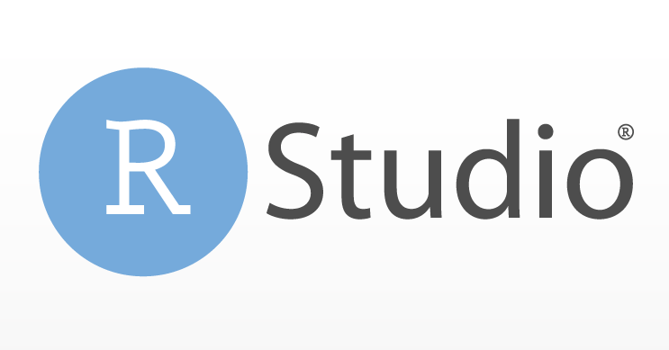

class: inverse, left, bottom
background-image: url("01_clase 1/media/logo_puc2.png")
background-position: 95% 7%
background-size: 20%


## `r rmarkdown::metadata$title`
----------------
### `r rmarkdown::metadata$subtitle`
#### `r rmarkdown::metadata$institute`
#### `r rmarkdown::metadata$author`
#### `r rmarkdown::metadata$date`

```{r xaringan-themer, include=FALSE, warning=FALSE}
library(xaringanthemer)
# style_mono_light(base_color = "#23395b",
style_duo(
primary_color = "#D3D3D3",
secondary_color= "#610E83",
# secondary_color= "#23395b", 
  # header_font_google = google_font("Roboto"),
  # text_font_google   = google_font("Roboto"),
  # code_font_google   = google_font("Fira Mono")
  text_font_google = google_font("Noto Sans")
)


```

```{r setup, echo=F, warning=FALSE, message=FALSE}
library(tidyverse)
library(formatR)
```

---
## Contenidos

**I. ¿Qué es R?**

**II. ¿Por qué usar R?**

**III. Iniciando R**

**IV. Bases de R**

**V. Ejercicio y cierre**

---
class: inverse, middle


# I. ¿Qué es R?


---
## ¿Qué es R? I

.pull-left[ 

- R es un lenguaje de programación para la computación estadística y la visualización creado por Robert Gentleman y Ross Ihaka. La primera versión data de 1995, por lo que el software cuenta con 25 años de desarrollo.

- Tiene la ventaja de ser gratuito y **libre**. Cualquier persona puede desarrollar nuevas funcionalidades.

- Una forma de contribuir al desarrollo de R es mediante la creación de un **paquete**. Actualmente existen 17.982 paquetes registrados en el CRAN (Comprehensive R Archive Network).

]

.pull-right[ 
```{r, echo = FALSE, out.width="60%", fig.align='center'}

```

]

---

## ¿Qué es R? II

.pull-left[ 

- Hay diversas plataformas en las que es posible correr código de R, pero actualmente el estándar es trabajar con el entorno de desarrollo integrado (IDE) RStudio. 

- Facilita el trabajo con el software agregando funcionalidades y mejoras de *quality of life*.

]

.pull-right[ 

```{r, echo = FALSE, out.width="60%", fig.align='center'}

```

]

---
class: inverse, middle


# II. ¿Por qué usar R?

---

## ¿Por qué usar R?: Características del software


- Porque es **gratuito**, a diferencia de otros softwares que se ven habitualmente en Ciencias Sociales (v.g. SPSS, Stata).

- Porque al ser **libre** cuenta con una comunidad más amplia que continuamente diseña nuevos paquetes.

- Es **más potente** que sus alternativas y articula de mejor forma la limpieza, análisis, visualización y reportería de datos.

- La desventaja es que tiene una curva de aprendizaje más pronunciada.

- Actualmente en el mercado hay una amplia oferta de diplomados y cursos para aprender R. Asimismo, el interés del sector público y privado en este software está en continuo crecimiento. 


---
class: inverse, middle


# III. Iniciando R


---

## RStudio

Al abrir RStudio nos encontraremos con tres paneles:

- La **Consola** en color lila.
- El **Enviroment** (ambiente de trabajo) en color salmón.
- Las **Utilidades** en color verde.


```{r, echo = FALSE, out.width="80%", fig.align='center'}
knitr::include_graphics("media/Panel_RStudio.png")
```

---

## Comenzar un Script (.R) 

- Los comandos que ejecutamos directamente en la consola no mantienen un registro, por lo que usaremos un script de R para conservar el código. Para iniciar un nuevo script tenemos dos alternativas:

   1. Seleccionar ***File*** → ***New File*** → ***R Script***

   2. Usar el atajo ***Ctrl/Cmd*** + ***Shift*** + ***N***
   

Ahora, probemos R como una calculadora en nuestro script.

```{r}
1 + 1
```

---

## Instalación de paquetes

- Los paquetes permiten agregar funciones adicionales a R. Para su instalación, debemos usar el comando **`install.packages("nombrepaquete")`**. 

- Se debe tener mucho cuidado con especificar de manera correcta el comando, o arrojará error.

- Para utilizar el paquete ya instalado, en la sesión actual, se debe utilizar el comando **`library("nombrepaquete")`**.

- Prueben instalando y llamando el paquete **`tidyverse`**.


---
class: inverse, middle


# IV. Bases de R

---
## Cálculos en R

- Es posible usar R como una calculadora. Las operaciones que más utilizaremos son las siguientes.

|   | **Operación**|
|---|---|
|+|Suma|
|-|Resta|
|*|Multiplicación|
|/|División|
|^|Potencia|
|sqrt |Raíz cuadrada|
|log()|Logaritmo base|


---
## Objetos en R

- En R podemos crear objetos que guarden información o resultados. Para ello, se escribe el nombre y se les asigna los valores con el operador **`<-`**.

- Los nombres permiten representar resultados de manera más fácil. Ejemplo:

  1. Ingresamos tres notas y las dividimos por 3. Este resultado queda guardado en el objeto llamado **"promedio"**.

  2. Luego, si queremos ver el resultado, basta con llamar al objeto **promedio**.

  3. Si el nombre del objeto ya existe, se sobreescribirá su contenido.
   
```{r}

promedio <- (5.5  + 3.8 + 6.1) / 3

```

     
```{r}

promedio

```

---
## Recomendaciones para nombrar objetos

- Evite caracteres especiales como tildes, ñ, espacios, etc.

- Consistencia en los nombres de variables. Puede usar nomenclaturas como **Snake Case** donde los nombres se escriben en el formato "nombre_objeto" o **Camel Case** que sigue el estándar "NombreObjeto".

- Recordar que R es sensible a mayúsculas y minúsculas. En el ejemplo anterior, definimos el objeto **`promedio`**. Si escribiéramos **`Promedio`** el software no lo reconocerá.

---
## Tipos de estructuras de datos

- R cuenta con clases y tipos de datos definidos de antemano, los cuales dependen de la información que contengan en su interior. Los comandos **`class`** y **`typeof`** sirven para preguntar el tipo de cada elemento.

| **Tipo de dato**|**Descripción**|**Ejemplo**
|---|---|
|`integer`|Números enteros|-1, 0, 1|
|`numeric`|Números reales|-0.5, 1/2, 1|
|`character`|Texto/String|"Erwin", "Armin", "Sasha", "Titanes"|
|`factor`|Datos categóricos|"Trabajo Social [1]", "Otra carrera [2]"|
|`logical`|Verdadero o falso|"TRUE", "FALSE"|

---
## Vectores

- Los **vectores** son ordenamientos unidimensionales que solo pueden contener un tipo de dato. Se definen con el comando **`c()`**.

```{r}
vect_numerico <- c(1, 3, 5, 7, 9) # Vector que solo contiene números
class(vect_numerico)
vect_letras <- c("Ud.", "Es", "Diabólico") # Solo contiene letras
class(vect_letras)
vect_char <- c(67, "40 años", 30) # Recordar que solo puede contener un tipo de dato
class(vect_char)
```

---
## Matrices

- Las **matrices** son estructuras bidimensionales, pues tienen filas y columnas, pero donde solo puede existir un tipo de dato. Se pueden generar con el comando **`matrix()`**.

**`matrix(vector, ncol = n, nrow= m, byrow = FALSE)`**.

```{r}

matriz_1 <- matrix(1:9, ncol = 3) # Llenado por columnas
matriz_1
matriz_2 <- matrix(1:9, ncol = 3, byrow = TRUE) # Llenado por filas
matriz_2
```

---
## Concatenación de vectores

- Los vectores se pueden transformar en una matriz con la ayuda de los comandos **`cbind()`** y **`rbind()`**. En el primer caso la concatenación es por columnas y en el segundo por filas.

.pull-left[


#### Concatenar por columnas 
```{r}

vector_1 <- c(1:5)

vector_2 <- letters[1:5] # letters es una 
# función de R

cbind(vector_1, vector_2)
```
]


.pull-right[


#### Concatenar por filas

```{r}

vector_1 <- c(1:5)

vector_2 <- letters[1:5] # letters es una 
# función de R

rbind(vector_1, vector_2)
```
]


---
## Acceder a los elementos de una matriz

- En R las matrices siempre siguen el orden (filas, columnas). Con esta lógica se puede seleccionar sus elementos: **`mi_matriz[i, j] ~ i = filas, j = columnas`**.

   - **`mi_matriz[i, ]`**: selecciona la **fila** i-ésima de la matriz.
   - **`mi_matriz[, j]`**: selecciona la **columna** j-ésima de la matriz.
   - **`mi_matriz[i, j]`**: selecciona el j-ésimo elemento de la i-ésima fila
   
Realicemos un ejemplo con la `matriz_2`

```{r}
matriz_2[2,] # Fila 2
matriz_2[,3] # Columna 3
matriz_2[1,3] # Fila 1, columna 3
```

---

## Data frame y Tibble

- En R los **data frame** son arreglos de datos bidimensionales (filas y columnas), pero que permiten distintos tipos de datos.

- Es el caso usual de datos estructurados que se ven en los cursos de análisis de datos: las filas representan observaciones y las columnas variables.

- Los **tibbles** son exactamente son muy similares a los data frame, pero con mejoras de calidad de vida. La función proviene del paquete **`tidyverse`**.

- Se pueden generar directamente tibbles con el comando **`tibble`** o transformar estructruras previas (como matrices) con **`as_tibble`**.

- En los tibbles y data frames uno también puede seleccionar directamente filas o columnas. Para ello, existen dos opciones:

```{r, eval = FALSE}
nombre_base$nombre_variable
nombre_base[["nombre_variable"]]
```


---

## Ejemplo Tibble

1. Crearemos tres vectores.
2. Creamos un objeto para guardar el tibble.

```{r}
nombre <- c("Julieta", "Gabriel", "Camila")
carrera <- c("Ingeniería", "Historia", "Biología")
gen <- c(2016, 2018, 2020)
```

```{r}
data_estudiantes <- tibble(nombre, carrera, gen)
data_estudiantes
```


---

## Listas

Las listas de R son estructuras de datos unidimensionales, pero donde en cada elemento de la lista pueden haber elementos de distinto tipo. Se definen con el comando **`list`**. Por ejemplo, podrían contener vectores, matrices, tibbles, etc.

```{r}
lista <- list("base_tibble_lista" = data_estudiantes,
              "matriz_lista" = matriz_1)
```

---
## Seleccionar elementos de una lista

Se puede acceder a los elementos de las listas usando **$** o **[[]]**, especificando el nombre del elemento o la posición:

```{r}
lista$base_tibble_lista
lista[[2]]
lista[["matriz_lista"]][3,2] # Para acceder a la fila 3 de la columna 2 de la matriz en la lista
```
---

## Comentar un Script 

Se puede comentar las líneas de código anteponiendo el símbolo **#**. Con esto podemos:

   - Ordenar el código: muy útil cuando lo compartimos o lo necesitaremos más adelante.
   - Describir qué es lo que está haciendo el código.
   - Indicar el código que no queremos ejecutar.

```{r}
# Este es un comentario para que mi yo del futuro lo recuerde
1 + 1 # R sumará estas operaciones

# 2 + 2 Este código no se ejecuta porque lo antecede un #
```

Es posible comentar o descomentar una o más líneas de código seleccionándolo y usando el atajo ***Ctrl/Cmd*** + ***Shift*** + ***C***


---

## Seccionar un Script 

Se puede establecer un orden de títulos y subtítulos que ordenen nuestro script mediante el siguiente esquema:

   - **#** y cuatro guiones medios indican una sección.
   - **##** y cuatro guiones medios indican una subsección anidada a la sección.
   - **###** y cuatro guiones medios indican una sub-subsección.
   
```{r}
# Proceso 1 ----

## Subproceso 1.1 ----

### Sub-subproceso 1.1.1 ----
```

Para ver la barra de navegación utilizamos el atajo ***Ctrl/Cmd*** + ***Shift*** + ***O***.

---

## Guardar un Script
   
- Si queremos guardar este script, tenemos tres alternativas:

   1. Seleccionar el ícono de disquette que está sobre el script.
   
   2. Ir a ***File*** → ***Save***.
   
   3. Usar el atajo ***Ctrl/Cmd*** + ***S***.
   
- Por último, tener en cuenta que RStudio cuenta con **autocompletado** y un **diagnóstico de errores** (aparecerá un ícono con una marca roja en forma de "x" en la línea donde hay problemas).

---
class: inverse, left, bottom
background-image: url("01_clase 1/media/logo_puc2.png")
background-position: 95% 7%
background-size: 20%

# <center>¡Gracias!</center>


## `r rmarkdown::metadata$title`
----------------
### `r rmarkdown::metadata$subtitle`
#### `r rmarkdown::metadata$institute`
#### `r rmarkdown::metadata$author`
#### `r rmarkdown::metadata$date`

